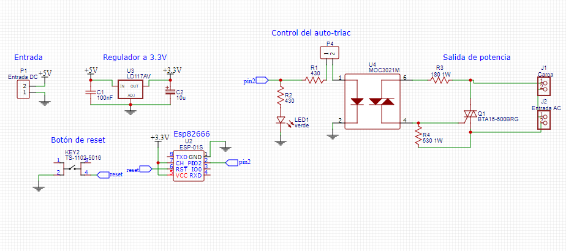

# Helios_esp_lamp
Este es un proyecto básico que permite comunicar dispositivos a través de comunicación mqtt, en este caso una lámpara con un celular o computador. El servidor que permite gestionar las comunicaciones es CloudMQTT aun así cualquier servidor debería servir.

Para realizar la placa PCB en donde se colocó el Esp8266 se necesita los siguietes dispositivos:

